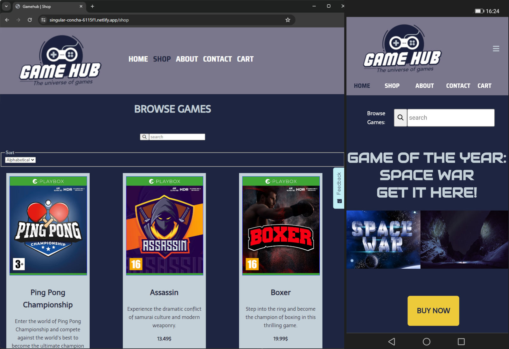

# Gamehub



Gamehub is a web-based e-commerce platform designed exclusively for video games. The platform is built using HTML, CSS, and JavaScript.

## Description

Gamehub is a simple and intuitive website that aims to provide a seamless experience for gamers to explore, purchase, and stay updated on the latest video game releases. Key features and aspects of the project include:

User-friendly Interface: The website boasts a clean and easy-to-navigate interface, ensuring an enjoyable browsing and shopping experience.
Game Listings: Browse an extensive catalog of video games with detailed descriptions and images.
E-commerce Functionality: Add games to your cart, proceed to checkout, and make secure transactions.
Responsive Design: Gamehub is designed to be accessible and visually appealing across various devices.

## Built With

- [HTML](https://developer.mozilla.org/en-US/docs/Web/HTML)
- [CSS](https://developer.mozilla.org/en-US/docs/Web/CSS)
- [JavaScript](https://developer.mozilla.org/en-US/docs/Web/JavaScript)

## Running

1. Clone the repo:

```bash
git clone https://github.com/Minu321/CA-HTML-CSS.git
```

2. Open index.html in vs code.

3. Run with live server.

## Contribute

If you'd like to contribute, please follow these guidelines:

1. Fork the repository.
2. Create a new branch for your feature: git checkout -b feature-name
3. Make your changes and commit them: git commit -m 'Add new feature'
4. Push to the branch: git push origin feature-name
5. Open a pull request.

## Contact me

- [LinkedIn](https://www.linkedin.com/in/mina-roseth-beni-652b90292/)
